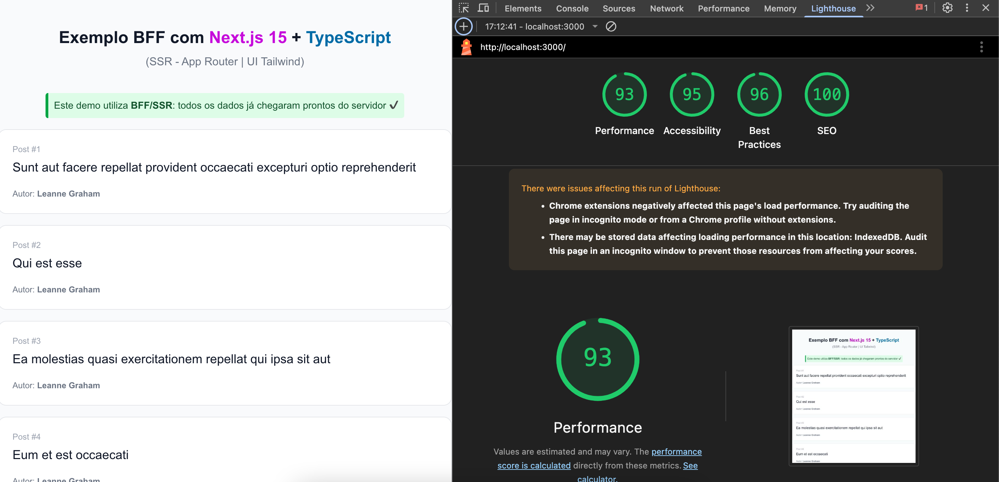
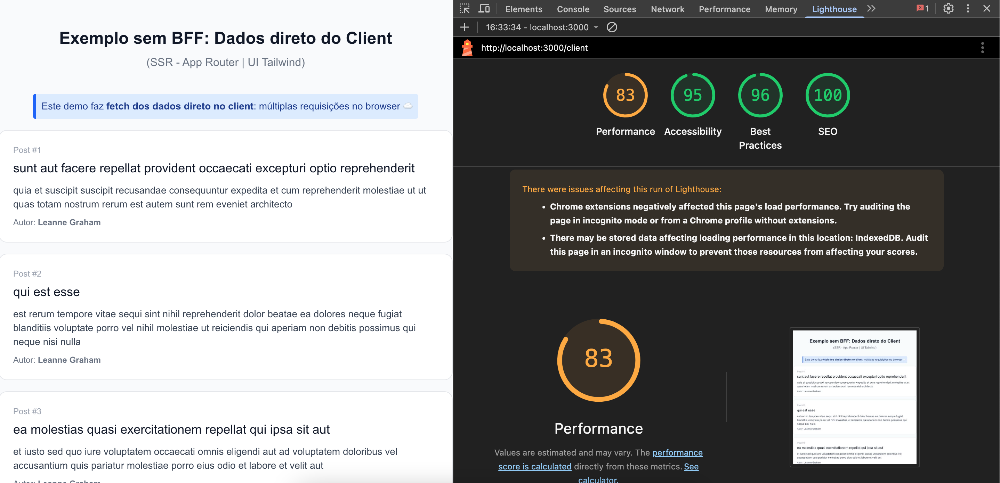

# 🚀 Exemplo BFF vs Client Fetch | Next.js 15


Este projeto demonstra, na prática, a diferença de fluxo, manutenção e performance entre dois modos de consumir APIs externas: fetch direto do client (React/browser) e via Backend-for-Frontend (BFF) usando Next.js (SSR ou API routes).

Usar BFF é cada vez mais comum em projetos reais de médio/grande porte, pois simplifica a experiência frontend e centraliza todo o tratamento de payload, autenticação e adaptação de dados.

- **BFF:** Centraliza e padroniza a lógica e transformação dos dados, entrega payload _final_ já tratado para o Frontend, melhora performance, segurança e manutenibilidade.
- **Client:** Todo tratamento, requisições e transformação precisam ser feitos no navegador; isso gera mais requests externos, duplicação de lógica e exposição da API.

---

| Característica      | BFF (Server/SSR)          | Client Only                |
| ------------------- | ------------------------- | -------------------------- |
| Quantidade Requests | 1 (otimizado e cacheável) | 1 + N (multiplicado)       |
| Performance         | Rápida (SSR/SSG)          | Depende da rede do usuário |
| Segurança           | API oculta e protegida    | API exposta no browser     |
| Manutenção          | Centralizada (BFF)        | Duplicada em todo front    |

## 💡 Demonstração de Performance

Testes feitos com o [Lighthouse](https://developers.google.com/web/tools/lighthouse) mostram claramente as diferenças de abordagem:

### SSR/BFF


<sub>O frontend recebe todo o conteúdo já processado na primeira resposta</sub>

### Client-side


<sub>O navegador executa múltiplas chamadas para montar a tela, aumentando a latência e sobrecarregando a rede do usuário</sub>

---

### Isso representa:

- Menor carga no navegador do usuário
- Menos latência percebida
- Melhor experiência para quem usa a aplicação
- Menos riscos com mudanças na API externa

### 🚀 Por que usar BFF?

- Centralizar regras de negócio e tratamento dados
- Reduzir acoplamento e exposição de endpoints sensíveis
- Facilitar testes e o versionamento da API

### 🔧 Como rodar o projeto

```bash
git clone https://github.com/guimullerdev/bff-with-nextjs
cd bff-with-nextjs
yarn install
yarn dev
```

### 🔧 Como visualizar os fluxos no navegador

- SSR/BFF: http://localhost:3000
- Client-side: http://localhost:3000/client
